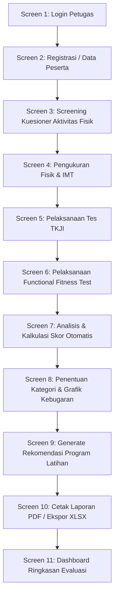

# 🏃‍♂️ Sriwijaya Sport Tec

> **Sistem Monitoring & Evaluasi Kebugaran Olahraga Masyarakat Berbasis Web**  
> *Aplikasi cerdas untuk penilaian kebugaran jasmani terintegrasi, analisis fungsional, dan preskripsi program latihan fisik secara saintifik.*

🌐 **Live Demo Application**: [https://sriwijayasporttec.vercel.app/](https://sriwijayasporttec.vercel.app/)

---

## 📋 Daftar Isi

- [Tentang Aplikasi](#-tentang-aplikasi)
- [Fitur Utama](#-fitur-utama)
- [Metodologi & Parameter Penilaian](#-metodologi--parameter-penilaian)
- [Alur Kerja Sistem (Workflow)](#-alur-kerja-sistem-workflow)
- [Teknologi & Stack](#-teknologi--stack)
- [Panduan Instalasi & Pengalihan Lokal](#-panduan-instalasi--pengalihan-lokal)
- [Struktur Proyek](#-struktur-proyek)
- [Fitur Ekspor & Pelaporan](#-fitur-ekspor--pelaporan)
- [Lisensi](#-lisensi)

---

## 💡 Tentang Aplikasi

**Sriwijaya Sport Tec** adalah platform digital interaktif berbasis web yang dirancang khusus untuk memfasilitasi pengujian, kalkulasi otomatis, analisis norma kebugaran, serta pemberian rekomendasi latihan fisik bagi atlet maupun masyarakat umum.

Aplikasi ini mengintegrasikan standar **Tes Kebugaran Jasmani Indonesia (TKJI)** dan **Functional Fitness Test (FFT)** lengkap dengan kategorisasi norma usia dan jenis kelamin. Hasil akhir pengujian disajikan dalam bentuk dashboard interaktif, grafik spider/radar, rekomendasi preskripsi FITT (*Frequency, Intensity, Time, Type*), serta dokumen laporan resmi siap cetak (PDF & Excel).

---

## ✨ Fitur Utama

1. **🔐 Autentikasi Penguji & Petugas**
   - Modul login aman bagi evaluator untuk mengelola data pengujian dan menjamin validitas rekapitulasi.

2. **👤 Pengelolaan Data Peserta**
   - Pencatatan identitas peserta (Nama, NIK, Usia, Jenis Kelamin, Tinggi/Berat Badan, Instansi/Komunitas).
   - Penyesuaian otomatis kelompok norma usia.

3. **📝 Screening Aktivitas Fisik (PAR-Q / GPAQ)**
   - Kuesioner pra-partisipasi untuk mendeteksi kesiapan fisik dan riwayat kesehatan sebelum tes dimulai.

4. **📊 Kalkulator IMT & Komposisi Tubuh**
   - Perhitungan otomatis Indeks Massa Tubuh (IMT / BMI) serta kategori risiko kesehatan sesuai kriteria Asia-Pasifik / Kemenkes RI.

5. **🏆 Tes Kebugaran Jasmani Indonesia (TKJI)**
   - **Lari Cepat (Sprint)**: Mengukur kecepatan akselerasi.
   - **Gantung Siku Tekuk / Pull-Up**: Mengukur kekuatan & daya tahan otot lengan/bahu.
   - **Baring Duduk (Sit-Up)**: Mengukur kekuatan otot perut.
   - **Loncat Tegak (Vertical Jump)**: Mengukur daya ledak (*power*) otot tungkai.
   - **Lari 12 Menit (Cooper Test)**: Mengukur kapasitas aerobik ($VO_2\text{max}$).

6. **🤸 Functional Fitness Test (FFT)**
   - **Sit to Stand 30 Detik**: Daya tahan & kekuatan fungsional otot tungkai bawah.
   - **Plank Test**: Ketahanan & stabilitas otot inti (*core stability*).
   - **Balance 1 Kaki**: Keseimbangan statis & kontrol postural.
   - **Sit and Reach**: Fleksibilitas otot hamstring & punggung bawah.
   - **Step Test Recovery**: Kapasitas kerja jantung & kardiorespirasi.
   - **Recovery Heart Rate (Delta HR 1 Menit)**: Kecepatan pemulihan denyut jantung pasca aktivitas.

7. **⚡ Engine Analisis & Rekapitulasi Otomatis**
   - Konversi skor mentah menjadi skor norma baku secara real-time.
   - Agregasi skor akhir dan penentuan predikat kebugaran (*Sangat Baik, Baik, Cukup, Kurang, Sangat Kurang*).

8. **🎯 Preskripsi Program Latihan & Aktivitas Fisik**
   - Rekomendasi latihan spesifik untuk setiap komponen yang masih di bawah standar.
   - Panduan intensitas, frekuensi, repetisi, dan jenis olahraga berbasis bukti (*evidence-based physical activity guidelines*).

9. **📄 Ekspor Laporan PDF & Excel**
   - **Cetak Laporan Resmi (PDF)**: Laporan komprehensif berformat rapi menggunakan `jsPDF` & `autoTable`.
   - **Ekspor Rekapitulasi (Excel)**: Spreadsheet lengkap data mentah, skor norma, dan rekomendasi via `SheetJS (XLSX)`.

10. **📈 Dashboard Ringkasan & Grafik Visual**
    - Visualisasi distribusi kebugaran dengan grafik radar (`Recharts`) untuk analisis aspek kebugaran secara holistik.

---

## 📐 Metodologi & Parameter Penilaian

| Parameter | Jenis Tes | Satuan / Ukuran | Komponen Kebugaran |
| :--- | :--- | :--- | :--- |
| **IMT** | Tinggi & Berat Badan | $kg/m^2$ | Komposisi Tubuh |
| **TKJI - Lari** | Sprint | Detik | Kecepatan |
| **TKJI - Pull/Hang** | Gantung/Pull-up | Detik / Repetisi | Kekuatan Otot Lengan |
| **TKJI - Sit-Up** | Sit-Up 60 Detik | Repetisi | Kekuatan Otot Perut |
| **TKJI - Vertical Jump**| Loncat Tegak | $cm$ | Power Otot Tungkai |
| **TKJI - Cooper** | Lari 12 Menit | Meter | Daya Tahan Jantung & Paru |
| **FFT - Sit to Stand** | 30 Detik Sit to Stand | Repetisi | Kekuatan Fungsional Tungkai |
| **FFT - Plank** | Uji Tahan Position | Detik | Stabilitas Otot Inti (*Core*) |
| **FFT - Balance** | Berdiri 1 Kaki Mata Terbuka/Tutup | Detik | Keseimbangan Statis |
| **FFT - Sit & Reach** | Kelenturan Duduk | $cm$ | Fleksibilitas |
| **FFT - Step Test** | Naik Turun Bangku & HR | bpm | Ketahanan Kardiorespirasi |
| **FFT - Recovery HR** | Selisih HR Pasca Tes | bpm | Kecepatan Pemulihan Jantung |

---

## 🔄 Alur Kerja Sistem (Workflow)



---

## 🛠️ Teknologi & Stack

- **Frontend Framework**: [React 19](https://react.dev/) + [TypeScript](https://www.typescriptlang.org/)
- **Build Tool**: [Vite 6](https://vitejs.dev/)
- **Styling**: [Tailwind CSS v4](https://tailwindcss.com/)
- **Animation Engine**: [Motion (Framer Motion)](https://motion.dev/)
- **Icons**: [Lucide React](https://lucide.dev/)
- **Data Visualization**: [Recharts](https://recharts.org/)
- **PDF Generation**: [jsPDF](https://github.com/parallax/jsPDF) & [jspdf-autotable](https://github.com/simonbengtsson/jsPDF-AutoTable)
- **Excel Generation**: [SheetJS (XLSX)](https://sheetjs.com/)
- **AI Analytics**: [@google/genai SDK](https://www.npmjs.com/package/@google/genai)
- **Deployment Platform**: Vercel ([https://sriwijayasporttec.vercel.app/](https://sriwijayasporttec.vercel.app/))

---

## 💻 Panduan Instalasi & Pengalihan Lokal

### Prasyarat
- **Node.js** (versi 18.x atau lebih baru)
- **npm** (versi 9.x atau lebih baru)

### Langkah-Langkah

1. **Kloning Repositori**:
   ```bash
   git clone https://github.com/mrbrightsides/sriwijayasporttec.git
   cd sriwijaya-sport-tec
   ```

2. **Instal Dependensi**:
   ```bash
   npm install
   ```

3. **Jalankan Mode Pengembang (Development)**:
   ```bash
   npm run dev
   ```
   Buka peramban di `http://localhost:3000`

4. **Build untuk Produksi**:
   ```bash
   npm run build
   ```

5. **Pemeriksaan Lint & Tipe TypeScript**:
   ```bash
   npm run lint
   ```

---

## 📁 Struktur Proyek

```
sriwijaya-sport-tec/
├── public/                 # Aset statis & ikon
├── src/
│   ├── components/
│   │   ├── screens/        # Modul layar alur evaluasi (Screen 1 - 12)
│   │   └── ui/             # Komponen UI modular
│   ├── utils/
│   │   ├── normaCalculator.ts # Engine kalkulasi norma baku & preskripsi latihan
│   │   └── exportUtils.ts     # Helper penanganan ekspor PDF & Excel
│   ├── types/              # Definisi interface & type TypeScript
│   ├── App.tsx             # Komponen utama & manajer state alur aplikasi
│   ├── main.tsx            # Entry point React
│   └── index.css           # Konfigurasi Tailwind CSS
├── metadata.json           # Metadata identitas aplikasi
├── package.json            # Daftar dependensi & script proyek
├── tsconfig.json           # Konfigurasi TypeScript
└── vite.config.ts          # Konfigurasi Vite
```

---

## 🖨️ Fitur Ekspor & Pelaporan

Sistem menyediakan fitur pencetakan instan yang dirancang ramah cetak fisik maupun digital:
- **Dokumen PDF Resmi**: Dilengkapi kops surat lembaga, tabel biodata, skor per modul tes, interpretasi norma, dan catatan saran instruktur.
- **File Excel (XLSX)**: Format tabular terstruktur yang dapat diolah kembali untuk analisis statistik atau integrasi basis data instansi.

---

## 🌐 Live Application

Aplikasi ini dapat diakses secara langsung di peramban tanpa memerlukan instalasi tambahan:
🔗 **[https://sriwijayasporttec.vercel.app/](https://sriwijayasporttec.vercel.app/)**

---

## 📄 Lisensi

Hak Cipta © 2026 **Sriwijaya Sport Tec**.  
Dikembangkan untuk mendukung pencapaian kebugaran jasmani masyarakat dan pembinaan prestasi olahraga secara modern, terukur, dan saintifik.
